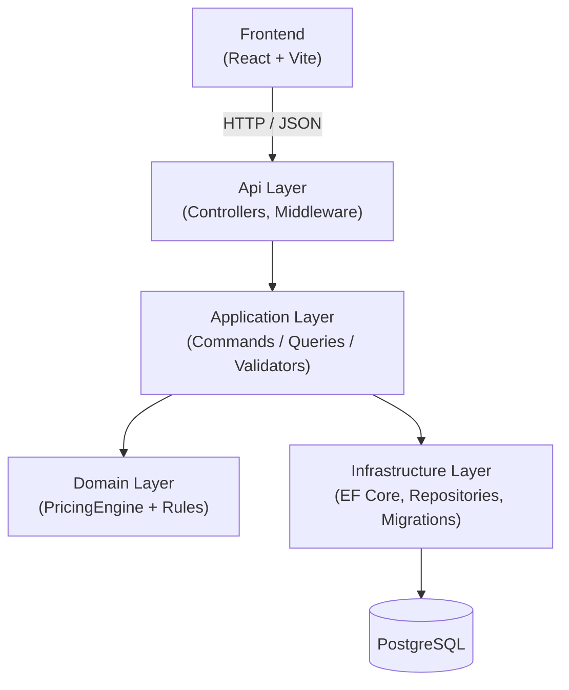

# StitchPrice

**A transparent pricing engine for custom embroidery shops.**

---

## Table of Contents

- [Overview](#overview)
- [Features](#features)
- [Tech Stack](#tech-stack)
- [Architecture](#architecture)
- [Pricing Engine](#pricing-engine)
- [Example Calculation](#example-calculation)
- [API Endpoints](#api-endpoints)
- [Screenshots](#screenshots)
- [Running Locally](#running-locally)
- [Testing](#testing)
- [Future Work](#future-work)

---

## Overview

StitchPrice is a full-stack pricing engine for custom embroidery businesses. It calculates
transparent, profitable quotes based on stitch count, garment cost, design complexity,
color count, quantity discounts, urgency fees, digitizing fees, and configurable business rules.

Built as a portfolio project to demonstrate clean backend architecture (.NET 9, Clean Architecture,
CQRS), a disciplined domain model with zero external dependencies, and a modern React frontend.
The focus is a strong, finished pricing engine — not payments, not multi-tenant SaaS.

---

## Features

- **Stitch-count pricing** — cost scales with design complexity at a configurable rate per 1,000 stitches
- **Color complexity fees** — each additional thread color adds a per-color overhead
- **Digitizing & setup fees** — one-time per-order fees, independently configurable
- **Bulk discounts** — quantity thresholds trigger a percentage discount on production cost
- **Urgency surcharge** — rush orders apply a multiplier to the post-discount subtotal
- **Configurable markup** — global percentage markup on top of all production costs
- **Minimum order enforcement** — a floor price guarantees no quote falls below a threshold
- **Product profiles** — preset garment costs and difficulty multipliers per product type (T-Shirt, Hoodie, Cap, etc.)
- **Quote history** — all quotes persisted and retrievable by ID or list
- **Admin settings** — live adjustment of all pricing parameters without redeployment
- **Scalar API UI** — interactive REST API explorer at `/scalar/v1`

---

## Tech Stack

| Layer | Technology |
|-------|------------|
| API | .NET 9, ASP.NET Core |
| OpenAPI | `Microsoft.AspNetCore.OpenApi` + Scalar |
| CQRS | MediatR 12, FluentValidation |
| ORM / DB | EF Core 9, PostgreSQL 16, Npgsql |
| Domain | Pure C# — zero external dependencies |
| Tests | xUnit, FluentAssertions |
| Frontend | React 19, TypeScript, Vite |
| State / Forms | TanStack Query v5, React Hook Form, Zod |
| Styling | Tailwind CSS, shadcn/ui |
| HTTP client | Axios |

---

## Architecture



**Dependency rule:** arrows flow inward. Domain has zero external package references.
Application references only MediatR and FluentValidation. Infrastructure and Api each
reference Application. Neither references the other. The domain model is testable
without a database — the pricing engine takes a `PricingContext` (plain data) and
returns a `PricingResult`, with no repository calls.

---

## Pricing Engine

The engine lives entirely in the Domain layer and orchestrates two distinct interfaces.

### `IPricingRule` — stateless transformation

```csharp
PricingAdjustment Apply(PricingContext context, decimal runningSubtotal)
```

Each rule receives the running subtotal accumulated by all preceding rules. Rules that
depend on it (BulkDiscount, UrgencyFee, Markup) use it. Rules that don't (GarmentCost,
StitchCount, fees) ignore it. The parameter is always the honest accumulated value —
no hidden state.

### `IPricingFinalizer` — post-calculation constraint

```csharp
PricingAdjustment? Finalize(decimal finalTotal)
```

Only `MinimumOrderFinalizer` uses this today. It is not a pricing rule — it enforces a
floor on the output rather than contributing to production cost. Forcing it into
`IPricingRule` would violate Liskov (the rule would need a fake `IsMatch` and a
throwing `Apply`). The two interfaces reflect two genuinely different questions:
*"what is your contribution?"* vs *"is the result acceptable?"*

### Rule execution order

| # | Rule | Depends on running total? |
|---|------|--------------------------|
| 1 | GarmentCostRule | No |
| 2 | StitchCountRule | No |
| 3 | ColorComplexityRule | No |
| 4 | DigitizingFeeRule | No |
| 5 | SetupFeeRule | No |
| 6 | BulkDiscountRule | Yes — discounts accumulated production cost |
| 7 | UrgencyFeeRule | Yes — surcharge on post-discount amount |
| 8 | MarkupRule | Yes — markup on post-discount + urgency |
| 9 | MinimumOrderFinalizer | N/A — post-calculation constraint |

**BulkDiscount runs before UrgencyFee.** The bulk discount rewards volume on the base
production cost. The rush surcharge applies to the already-discounted amount. This is
a deliberate business decision — changing the order changes customer-facing pricing.

---

## Example Calculation

**Input:** 10 hoodies, 18,000 stitches, 4 colors, digitizing requested, standard delivery.

Default settings: 10 GEL per 1,000 stitches · 5 GEL per color · 30 GEL digitizing ·
20 GEL setup · 10% bulk discount at qty ≥ 10 · 40% markup · 50 GEL minimum order.

| Step | Rule | Calculation | Amount | Running Total |
|------|------|-------------|--------|---------------|
| 1 | Garment cost | 35 GEL × 10 units | +350.00 GEL | 350.00 GEL |
| 2 | Stitch cost | 18,000 / 1,000 × 10 × 10 units | +1,800.00 GEL | 2,150.00 GEL |
| 3 | Color complexity | 4 colors × 5 GEL | +20.00 GEL | 2,170.00 GEL |
| 4 | Digitizing fee | one-time | +30.00 GEL | 2,200.00 GEL |
| 5 | Setup fee | one-time | +20.00 GEL | 2,220.00 GEL |
| 6 | Bulk discount | 10% of 2,220.00 | −222.00 GEL | 1,998.00 GEL |
| 7 | Urgency fee | not urgent | 0.00 GEL | 1,998.00 GEL |
| 8 | Markup | 40% of 1,998.00 | +799.20 GEL | 2,797.20 GEL |
| 9 | Minimum order | above 50 GEL floor | — | — |
| **Final** | | | | **2,797.20 GEL total · 279.72 GEL/unit** |

This is the exact output verified by the end-to-end test in
`tests/StitchPrice.UnitTests/Pricing/PricingEngineTests.cs`.

---

## API Endpoints

| Method | Path | Description |
|--------|------|-------------|
| `POST` | `/api/pricing/calculate` | Calculate and persist a new quote |
| `GET` | `/api/pricing/quotes` | List all saved quotes |
| `GET` | `/api/pricing/quotes/{id}` | Get a single quote by ID |
| `GET` | `/api/admin/pricing-settings` | Read current pricing settings |
| `PUT` | `/api/admin/pricing-settings` | Update pricing settings |
| `GET` | `/api/admin/product-profiles` | List all product profiles |
| `POST` | `/api/admin/product-profiles` | Create a product profile |
| `PUT` | `/api/admin/product-profiles/{id}` | Update a product profile |

Full interactive explorer (Scalar UI): `http://localhost:5000/scalar/v1`

---

## Screenshots

<!-- TODO: add screenshots once UI styling is finalized -->
<!-- Suggested: Calculator form · Quote history · Settings admin -->

---

## Running Locally

### One command (Docker)

```bash
docker compose up --build
```

Then in a second terminal:

```bash
cd frontend
npm install
npm run dev
```

| Service | URL |
|---------|-----|
| Frontend (Vite) | http://localhost:5173 |
| API | http://localhost:5000 |
| Scalar API UI | http://localhost:5000/scalar/v1 |

On first start the API applies all pending EF Core migrations and seeds one default
`PricingSettings` row plus 8 `ProductPricingProfile` rows (T-Shirt, Hoodie, Polo, Cap,
Patch, Sweater, Jacket, Custom). The seed is idempotent — restarting the API is safe.

### Without Docker

Start PostgreSQL locally (`localhost:5432`, user `postgres`, password `postgres`,
database `stitchprice`), then:

```bash
# Apply migrations and start the API
dotnet run --project src/StitchPrice.Api

# In a second terminal
cd frontend
npm install
npm run dev
```

The connection string can be overridden via environment variable:

```bash
ConnectionStrings__Default="Host=...;..." dotnet run --project src/StitchPrice.Api
```

### Reset the database

```bash
docker compose down -v   # removes the pgdata volume
docker compose up --build
```

---

## Testing

```bash
# 44 unit tests — Domain + Application, no database required
dotnet test tests/StitchPrice.UnitTests

# Integration tests — require a running PostgreSQL
dotnet test tests/StitchPrice.IntegrationTests

# Full solution build (TreatWarningsAsErrors = true — zero warnings policy)
dotnet build
```

---

## Future Work

- Containerize the React frontend for a fully self-contained `docker compose up`
- Multi-currency support
- PDF quote export
- Customer accounts with saved design presets
- GitHub Actions CI workflow (build, test, lint on every PR)
- Integration test database isolation (per-run database teardown)
